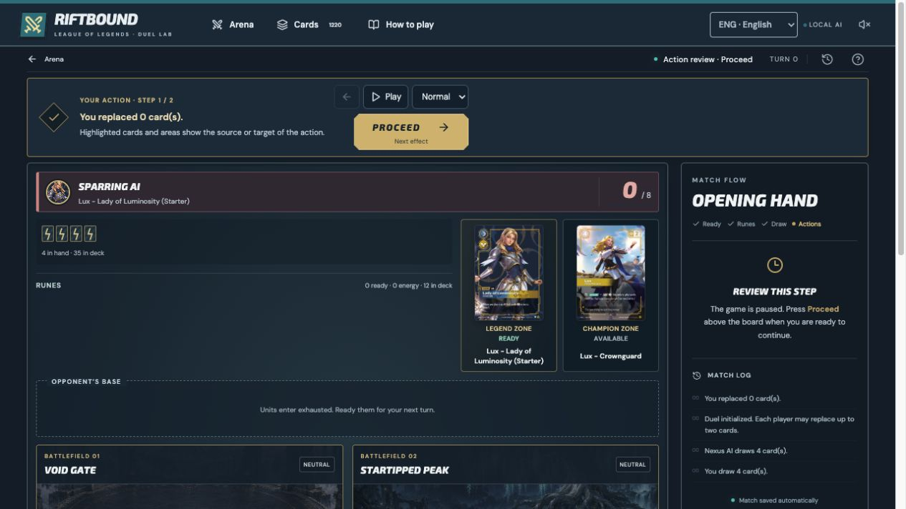

# Production deployment

## Significant-event animations — 8 October 2026

The [important game animations](SIGNIFICANT-MOTION.md) use Remotion, native
Tesseract vector authoring and Hyperframes' shared GSAP timeline. The [focused
record](significant-motion-qa-2026-10-08.json) preserves the final source and
verification scope. The local suite passes 127 tests in 12 files, production
build and catalog consistency. Existing game and AI inputs remain byte-identical
to `2c406626a6c74126bce35183a40ee87cf8804581`. Exact-commit CI, both READY aliases
and fresh production worker/offline checks are verified after push.

## Desktop and mobile polish — 8 October 2026

The [visual polish](VISUAL-POLISH.md) improves battlefield spacing, mobile touch
controls and signature/event presentation. The [focused validation
record](visual-polish-qa-2026-10-08.json) preserves the final source hashes and
actual process receipts. It passes 99 tests across 11 files, production build and
catalog consistency. Game, AI and catalog inputs remain unchanged from
`caba4be36b837950f3a8034302c0273bcfdbd644`; earlier regression and pilot records
remain historical. Exact-commit CI, both READY production aliases and fresh
worker/offline smoke checks are verified after push.

## Final Spiritforged follow-up — 8 October 2026

The final follow-up corrects Rumble recycling and Riposte counter finalization after control changes. It preserves original physical card ownership, handles attached hybrid Gear aliases once and reuses the common counter resolver. The [focused validation](final-physical-ownership-validation-2026-10-08.json) passed **247 tests across ten files**, including nine new cases, plus production build, catalog consistency and report guards. Its compiled build is **a4bb75b3d4e9**, with **81 offline assets**. Required CI now also runs both existing Spiritforged suites.

This section records the locally verified follow-up before push; its exact final commit, required CI and READY production alias checks are recorded separately. The deployment and complete-regression receipts below describe the earlier `6249dac` application release, whose source differs from this follow-up only in `src/game/spiritforged.ts` and its CI-covered physical-board regression file. The 2,681-test full suite, 169-pair matrix and 32-game pilot were not repeated for this follow-up.

## Catalog, mobile and practice release — 8 October 2026

Application commit `6249dac131faf033a842fa2e482c180be80c9f59` was pushed to `main`. Both linked production projects reached **READY** for this exact commit, with their public aliases resolving to those deployments:

- [riftbound-duel-lab.vercel.app](https://riftbound-duel-lab.vercel.app/) — `dpl_5BjP14Z7PT53aUBLqC4kAk4pmxU9`.
- [riftbound-duel-lab-pgml.vercel.app](https://riftbound-duel-lab-pgml.vercel.app/) — `dpl_GoSDqc6ckLk3ENwkMjVHoDAvkRfU`.

The [required GitHub checks](https://github.com/tuitamogamer-gpt/riftbound-duel-lab/actions/runs/37714947999) completed successfully for that commit. Before publication, the complete frozen implementation passed **2,681 unique tests across 120 files**, all **169 ordered precon pairs**, and a fresh **32-game v3 bot pilot** without illegal or blocked games. The [regression record](regression-validation-2026-10-08.json) preserves source hashes and all three actual exit-0 process receipts; interrupted attempts contribute no cases. Catalog coverage remains **1,459 executable entries and all 13 precons** from the unchanged provider snapshot.

Real production Chromium checks passed on both aliases with compiled build **b2b14dc063c7**, **81/81 offline application assets**, 55 selected-deck artwork images, the exact new worker, a real cold offline planner decision without fallback, and paused reload/resume at portrait and landscape sizes. A retained old-primary client also passed the actual **cefb602dc1e3 → b2b14dc063c7** upgrade: the new worker waited, the old client retained its offline shell and cold lazy chunk, the saved duel remained byte-identical, and activation after closing the old client removed the old app cache while preserving 38 downloaded artwork images. See [production continuity, offline and API evidence](reliability-qa-2026-10-07.json).

The [deployed feature checks](live-feature-qa-2026-10-08.json) exercised quoted/multi-term and printing-alias search, Energy sorting, filter reset, Undo/Redo, page reload and explicit draft recovery, and real lesson completion/Undo/Retry at 390 and 1440 pixels. The [native WebKit production follow-up](webkit-mobile-qa-2026-10-08.json) verifies both aliases’ exact assets and response headers, real touch duel controls at 390×844 and 844×390, and Italian catalog/training controls at 320×568. It uses Linux mobile emulation and does not establish testing on physical iOS hardware. The [practice guide](PRACTICE-GUIDE.md) documents the new tools.

A separate [complete production UI game](full-duel-ui-qa-2026-10-08.json) connects the real Normal worker, mobile controls, saved result, captured replay and BO3 flow. The deliberately passing human lost 0–8 on turn 13; the game records 45 decisions, including 29 actual worker choices without prepared fallbacks. Turn/key-moment navigation and the exact-frame note survived reload; game 2 started with the 0–1 score preserved. This one synthetic integration game does not measure AI strength, and game 2 was not played to completion.

Both deployed API entries reject GET with **405** and malformed JSON with **400**, using `private, no-store`, `nosniff` and `no-referrer`. These probes create no rooms or storage objects. **Hosted private rooms remain blocked by the private Blob store configuration**: the connected account previously rejected provisioning with HTTP 403. Local two-seat validation remains separate; see [ONLINE-DUELS.md](ONLINE-DUELS.md).

## Practice tools release — 7 October 2026

Application tools were published in `8a1bfca67a2f153bf044ce3356cc49b50547d7a8`; the Node function packaging and guest-base labels were corrected in `bb08fe110334b0a5a3b931c8b72040a28865148d`. Both production builds for the latter commit reached **READY**, with their public aliases confirmed:

- [riftbound-duel-lab.vercel.app](https://riftbound-duel-lab.vercel.app/) — `dpl_2nubG31wQ4wxyTC5C7gSM3S6h2GW`.
- [riftbound-duel-lab-pgml.vercel.app](https://riftbound-duel-lab-pgml.vercel.app/) — `dpl_FkCYQN5dQfRzB159H2cBS1Jbckq4`.

The required GitHub checks passed for both commits. Public Chromium checks verified the primary app's offline shell, lazy screens, first offline bot decision, saved-game reload and portrait/landscape layout. The [offline evidence](offline-production-qa-2026-10-07.json) records 77 cached application assets, 38 selected-deck images, no failed requests and an actual 24-node worker decision without fallback.

Both deployed `/api/duel` functions reject GET with 405 and return the guarded `storage-unavailable` response with 503 when creating a room. Their responses use `private, no-store` and `no-referrer`. The primary app shows a friendly storage message and returns to the lobby at 390×844 and 1440×900. **Online room availability remains blocked by the private Blob store configuration:** the connected account rejected store creation with HTTP 403. See [ONLINE-DUELS.md](ONLINE-DUELS.md) for setup and local two-player validation.

The fresh paired AI pilot completed all 32 games without illegal or blocked games; its outcomes and limits are recorded in [AI-CATALOG-UPDATE.md](AI-CATALOG-UPDATE.md). The consolidated regression inventory covers 2,568 unique passing cases and all 169 ordered precon pairs. It combines completed checkpoints, recovered executed assertions and exact reruns, while preserving original interrupted/failed process status. See [VALIDATION.md](VALIDATION.md) and the [coverage record](regression-validation-2026-10-07.json).

The final follow-up corrects loading Pack of Wonders' legal Hidden board-card choices, adds positive and malformed-save regressions, and prevents long deterministic test loops from starving runner acknowledgements. Production compilation and the actual Node function-entry import pass with this save correction. These changes leave the paired AI pilot's engine, planner and catalog inputs intact.

## Initial release — 2 October 2026

Published on **2 October 2026**.

- Public URL: https://riftbound-duel-lab.vercel.app/
- Private source repository: https://github.com/tuitamogamer-gpt/riftbound-duel-lab
- GitHub account: `tuitamogamer-gpt`; branch: `main`.
- Vercel account: `tuitamogamer-7851`; team: `tuitamogamer-7851s-projects`.
- Vercel project: `riftbound-duel-lab` (`prj_vSRYnKQZudmN7OY9uHdq35AXHZw0`).
- Deployed application commit: `bc045d8f4ecde78b637264f1d8e10b59e6b417c6`.
- Deployment: `dpl_ERb6EPmadkoBPy84XdQ3rmAYzcTH`; target: production; status: READY.
- Build: Vite 7.3.6, TypeScript and `npm run build`; remote build approximately 28 seconds.
- Inspector: https://vercel.com/tuitamogamer-7851s-projects/riftbound-duel-lab/ERb6EPmadkoBPy84XdQ3rmAYzcTH

## Verification

Before publishing, all **1,031 tests in 35 files** passed, along with `npm run cards:check`, `npm run build`, and `git diff --check`. The existing Vite chunk-size warning remains non-blocking.

Vercel metadata confirms the deployed GitHub commit and production alias. An unauthenticated HTTP request to the public URL returned **200**. The response includes `nosniff`, `DENY` framing and the configured referrer policy.

The public application loaded the lobby and started an Annie versus Lux duel. Keeping the opening hand entered manual review at **step 1/2**. Reloading and selecting **Resume duel** restored the same step. All rendered image elements were loaded, and the browser's captured warning/error log was empty during this smoke test.



## Future updates

The first release was pushed with GitHub CLI and deployed with Vercel CLI. The Vercel project now builds production from pushes to `main`. A release is complete only after the deployment for that exact commit reaches READY, the public alias points to it, and the public game passes its smoke test.

From the repository root, after tests and the build pass:

```sh
git push origin main
```

The Vercel CLI remains available for a manual production deploy when needed:

```sh
/Users/boro/.local/share/riftbound-publish/vercel-cli/node_modules/.bin/vercel deploy --prod --yes --scope tuitamogamer-7851s-projects
```

The local `.vercel/` project link and `.env.local` are ignored by Git. Credentials remain in the CLI's normal authentication storage and are not committed. Documentation-only commits still trigger a build but do not change the application.

## Release history

- 2026-10-05, commit `786f5f7`: visual system pass (match table skin, lobby and dialog polish); see [DESIGN-REVIEW.md](DESIGN-REVIEW.md). Deployed automatically from `main`.
