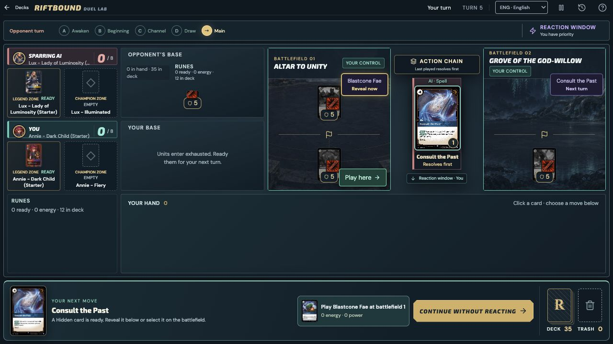
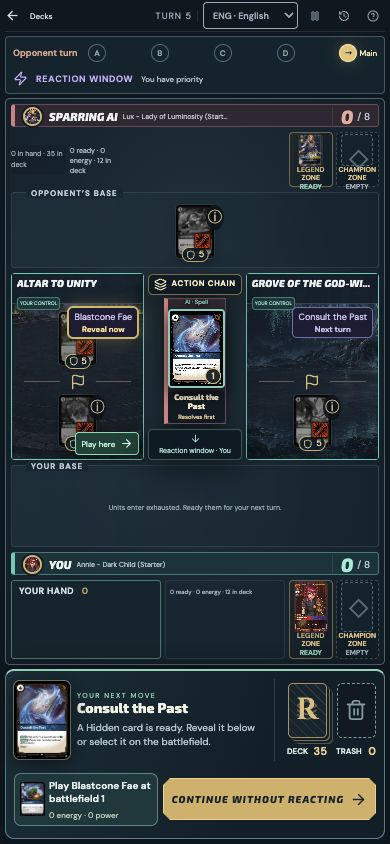

# Hidden reactions and play triggers

Verified 4 October 2026 against the [official Rules Hub](https://playriftbound.com/en-us/rules-hub/) and its [16 July Core Rules](https://cmsassets.rgpub.io/sanity/files/dsfx7636/news_live/e9ac8e3d33e0f78cef296f5945aba7bc1313b086.pdf), sections 421 and 811.

- Hidden reactions now appear in the bottom decision dock without requiring the player to discover an unmarked battlefield button. A legal human reaction prevents automatic passing.
- Each own Hidden card shows whether it can be revealed now, is waiting for a later turn or priority, or is blocked. Selecting it explains the restriction and shows that its base cost is ignored. Enemy identities and readiness remain private.
- Hide accepts the hand and Champion Zone, costs one any-domain power, and is available in an open state on the controller's turn. It neither plays the card nor triggers play abilities. Cards hidden this turn cannot be revealed until the following turn.
- Targeted play effects such as Blastcone Fae are restricted to their original Hidden battlefield when selecting and resolving the target. A Hidden Blade target that leaves that battlefield before resolution is no longer legal. Explicit other-location effects such as Tideturner and Resonating Strike retain their exceptions; separate multi-target scripts retain their per-target rules.
- Existing hide/play observers remain separate: Katarina's hide effect is distinct from its played-from-facedown effect; Ember Monk and Black Market Broker trigger after the Hidden card resolves.

Validation: `tests/hidden-flow.test.ts` first reproduced five failures; the fix makes them pass. Additional checks cover ordinary hand plays, saved trigger choices, readiness feedback, opponent privacy, existing Hidden interactions, full games, and the build. The synthetic `tests/hidden-preview.html` fixture runs on a separate localhost origin. Browser verification revealed Blastcone Fae during an opponent spell, selected an enemy at the same battlefield, and observed its Might change from 5 to 3; the other Hidden card remained unavailable because it was hidden in the current turn.

Final focused run: **253 tests passed across 9 suites**. Build, card-coverage check, and whitespace check passed. Desktop (1280×720) and mobile (390×844) match their viewport dimensions with no page overflow and no captured browser errors. Concurrent work added `card-wave6.test.ts`; its latest separate run still had one failure in the Fae Dragon test, outside this Hidden fix.

