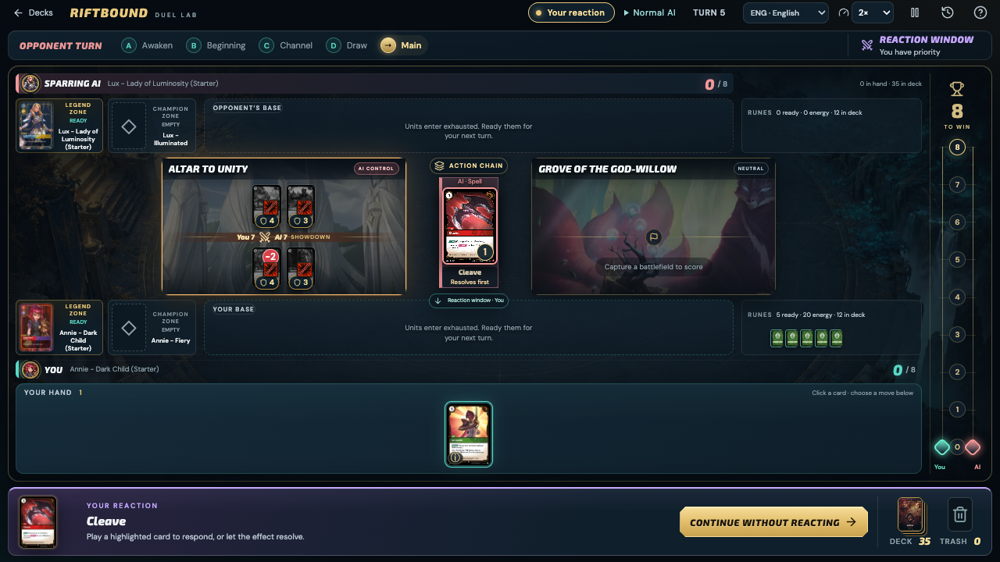
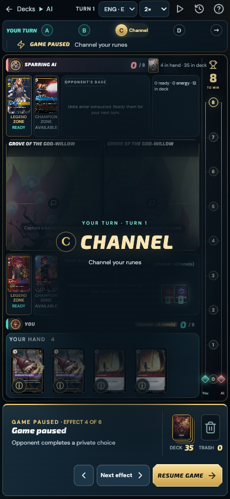

# Playback and decision clarity — 6 October 2026

The match toolbar offers 0.5×, 1× and 2× playback. This changes effect presentation and the delay before an already chosen bot move. It does not change the bot's search budget, rules, or available decisions. Forced human priority passes retain their existing reading delay; playable reactions and explicit end-turn choices always wait for the player.

Pause exposes Previous effect and Next effect in the existing decision dock, with the current frame count. These controls browse recorded snapshots without executing actions, changing the committed match, or adding replay decisions. Finish review keeps the game paused. The pause, exact frame and speed survive reload; older saves remain compatible. A frame entered while paused shows static, readable phase and card visuals.

The toolbar now separates turn ownership from decision ownership: a response during the opponent's turn is labelled Your reaction. Required choices, damage assignment, resolving effects and pause each have their own status. The selected card does not hide the reaction label in the decision dock. New controls are translated into English, Serbian and Italian.

## Verification

- Full baseline: **1,646 tests in 56 files passed**, including all 169 ordered precon pairings with conservation and progress checks.
- Final affected-area run: **81 tests in 7 files passed**, including eight new playback/status regressions, persistence, turn presentation, table moments, decision presentation, localization and bot acceptance.
- Production build, `npm run cards:check` and `git diff --check` passed. The existing bundle-size advisory remains. Coverage is unchanged: 1,186 executable entries out of 1,456 registered entries.
- Real browser checks at **1280×720, 390×844 and 320×740**, each in English, Serbian and Italian: no page overflow, clipped controls, overlapping toolbar/decision buttons, or page errors.
- Actual clicks verified forward/backward review, readable paused phases, reload recovery, finishing review without advancing play, and resuming the human decision. At 2×, a playable human reaction during the opponent turn remained unchanged over a 3.5-second observation and could still be selected.

The synthetic fixture is `tests/playback-preview.html`. On an isolated dev origin, rerun `scripts/playback-check.mjs` using an installed Playwright module; `PLAYWRIGHT_MODULE`, `CHROMIUM_EXECUTABLE`, `BASE_URL` and `QA_OUTPUT` can select existing local tools and output paths. It writes screenshots and `report.json` under `test-results/playback/` by default. No real saved duel is used.

