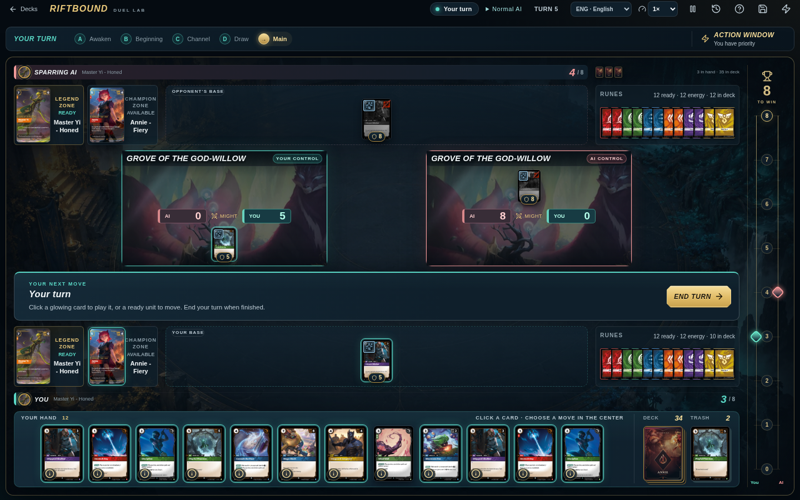
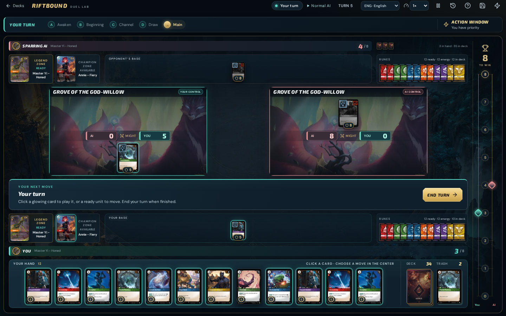
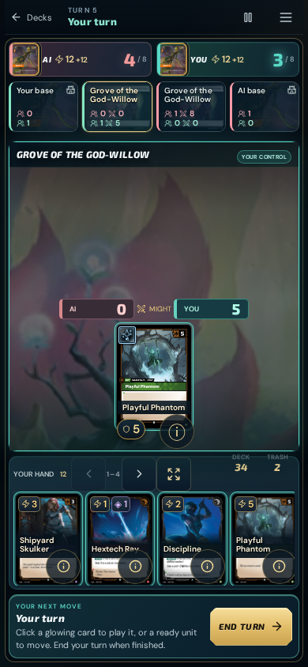
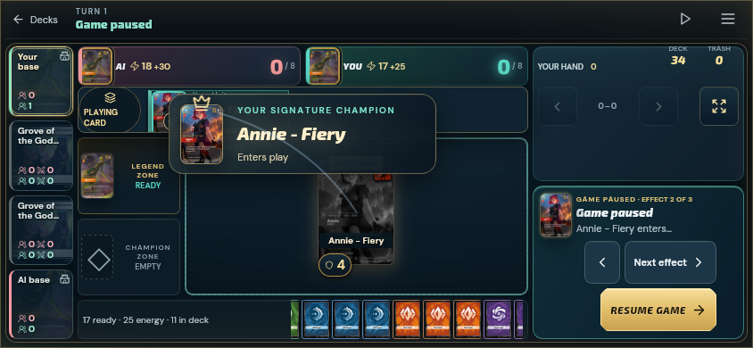

# Desktop and mobile polish — 8 October 2026

The desktop table gives battlefields more vertical space at 1280×720 and
1440×900 while keeping the hand readable. Bases, runes and turn cues use the
same navy, brass and teal palette; long action stacks scroll inside their lane.
On shorter desktop windows, compact Might badges remain clear of Exhausted
tokens.

Mobile battlefield selection has a stronger frame. Hand controls and pile
buttons have larger touch targets, and the menu header and Close button stay
visible while scrolling. Hand and menu entrances respect reduced-motion
preferences.

Signature champions enter with a portrait banner and a short progress underline
matched to playback speed. Important events use quieter edge lighting and
distinct icons. Champion, score, draw and phase moments receive one live
announcement. Paused effects remain readable; landscape notices sit inside the
table instead of covering the score or hand controls.

## Verification

The [validation record](visual-polish-qa-2026-10-08.json) records the final source
hash, actual process results and browser scope. The focused suite passes
**99 tests across 11 files**, including announcement deduplication and private
draw protection. Production compilation and catalog checks pass; all **1,459
executable entries and 13 precons** remain available. Required CI now includes
the existing event, table-moment, effect and playback suites.

Browser checks cover desktop interactions, short windows, portrait and landscape
touch controls, focus return, paused playback and reduced motion. Native
WebKit checks use Linux WPE WebKit 26 with mobile emulation; they do not establish
testing on physical iOS hardware. Six-card action-stack stress checks use
synthetic DOM content to verify scrolling, without asserting a legal game state.

Game rules, AI and catalog source files are byte-identical to baseline
`caba4be36b837950f3a8034302c0273bcfdbd644`. Earlier full regression, precon matrix
and bot-pilot records retain their original scope; those runs were not repeated
for this presentation change. Exact-commit CI, production alias status and fresh
worker/offline checks are verified after push.

## Screenshots

These screenshots show synthetic local fixtures. The desktop comparison uses
the exact baseline commit and the final source at the same viewport and state.

Before, 1440×900:

After, 1440×900:

Mobile portrait, 390×844:

Paused signature entrance in native WebKit, 844×390:

